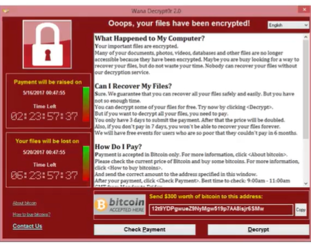
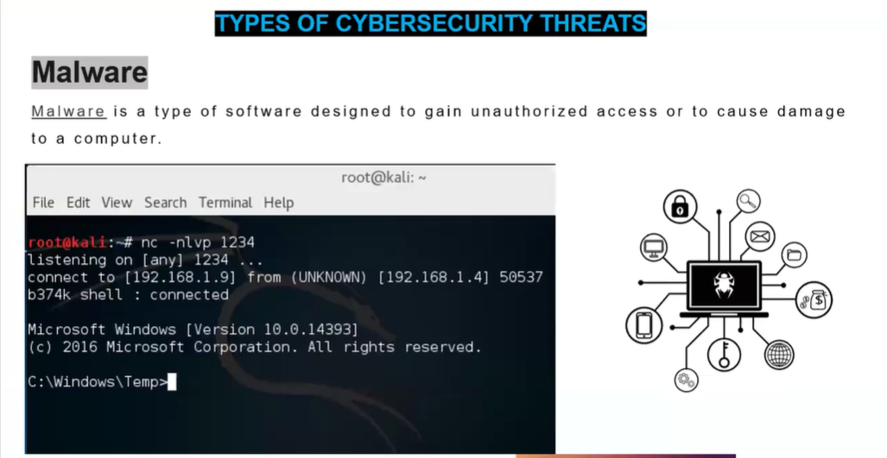

# Day 02: Ethical Hacking - Cybersecurity Session

## 🛡️ Types of Cybersecurity Threats

### 1️⃣ Phishing
- **Definition:** Sending fraudulent emails resembling legitimate sources to steal sensitive information.
- **Example Scenario:** You receive an email saying your university password will expire, urging you to click a fake link.
- **Real World Example:** Email pretending to be from "MyUniversity" asking for login credentials.
- 

### 2️⃣ Ransomware
- **Definition:** Malware that encrypts your data, demanding payment to restore access.
- **Example Scenario:** Opening an attachment encrypts your files with a message demanding Bitcoin.
- **Real World Example:** WannaCry ransomware attack on hospitals and businesses.
- 

### 3️⃣ Malware
- **Definition:** Software designed to gain unauthorized access or cause damage.
- **Example Scenario:** Downloading cracked software that installs a reverse shell for attackers.
- **Real World Example:** Malware creating backdoors on Windows for persistent access.
- 

### 4️⃣ Social Engineering
- **Definition:** Manipulating people to gain confidential information.
- **Examples:**
  - **USB Rubber Ducky:** A device that injects malicious keystrokes when plugged in.
  - **O.MG Cable:** Looks like a normal USB cable but injects payloads into devices.
- **Real World Scenario:** Dropping infected USBs in a company parking lot.

### 5️⃣ Man in the Middle Attack (MITM)
- **Definition:** Intercepting and altering communication between two parties without their knowledge.
- **Example Scenario:** Attacker intercepting login credentials on public Wi-Fi.
- **What is a cookie?** A small piece of data stored in browsers used to maintain session states, which can be stolen in MITM attacks.

### 6️⃣ Zero Day Attack
- **Definition:** Exploiting unknown and unpatched vulnerabilities.
- **Example Scenario:** An attacker uses a browser vulnerability before it is patched.
- **Key Terms:**
  - One-click exploit
  - Fully undetected payload
  - Recent exploits: xVenom, Venom, xWorm targeting Windows, Linux, and macOS.

---

## 📦 VirtualBox: Download and Install (5 Points)
1. Visit [VirtualBox Download](https://www.virtualbox.org/wiki/Downloads).
2. Download the version suitable for your OS (Windows/Linux/Mac).
3. Run the installer and follow on-screen instructions.
4. Allow necessary network configurations.
5. Complete installation and launch VirtualBox.

---

## 🐉 Kali Linux: Download and Install on VirtualBox (5 Points)
1. Visit [Kali Linux Download](https://www.kali.org/get-kali/).
2. Download the ISO or VirtualBox image.
3. Open VirtualBox and click **New**.
4. Allocate RAM and create a virtual hard disk.
5. Load Kali ISO in storage settings and start the VM to install.

---

## 🔧 First Boot Actions in Kali Linux (3 Points)
1. Update system using `sudo apt update && sudo apt upgrade`.
2. Set up snapshot in VirtualBox for safe rollback.
3. Install additional tools as needed for ethical hacking labs.

---

🪪 **Author:** Shreya RD  
🎓 **For:** Cybersecurity Internship Daily Log Day 02

