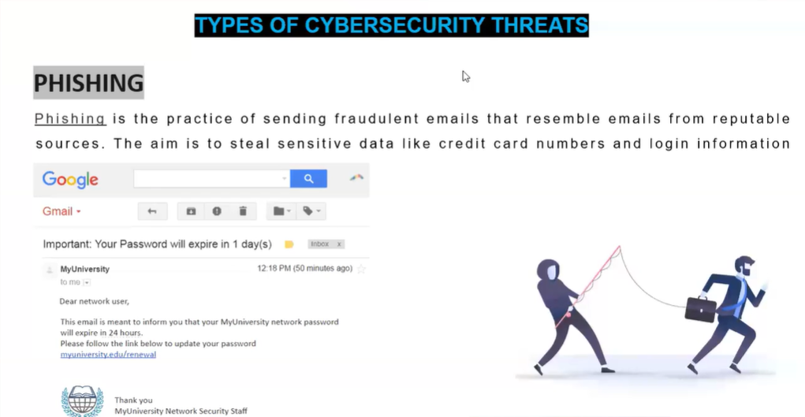

# Day 02: Types of Cyber Secuity Threat

### 1️⃣ Phishing
- **Definition:** Sending fraudulent emails resembling legitimate sources to steal sensitive information.
- #### Example Scenario

   You get an email saying your university password will expire and asking you to click a link to reset it. The link leads to a fake login page. If      you enter your credentials, the attacker collects them and accesses your university account.

#### Real World Example

   An email pretending to be from “MyUniversity” asks you to verify your account by logging in through a link. The link leads to a phishing site, and    if you enter your details, the attacker can access and misuse your university account.

- 

### 2️⃣ Ransomware
- **Definition:** Malware that encrypts your data, demanding payment to restore access.
- #### Example Scenario

  Opening an email attachment unknowingly runs malicious ransomware on your computer, encrypting your files and displaying a message demanding          payment in Bitcoin to unlock your data.

#### Real World Example

The **WannaCry ransomware** attack targeted hospitals and businesses worldwide, encrypting critical files and demanding Bitcoin payments to restore access, severely disrupting healthcare and operations.

- 

### 3️⃣ Malware
- **Definition:** Software designed to gain unauthorized access or cause damage.
- #### Example Scenario

  Downloading cracked software unknowingly installs a reverse shell on your system, allowing attackers to gain remote control and execute commands     on your computer without your knowledge.

#### Real World Example

Malware creating backdoors on Windows systems for persistent access, allowing attackers to remotely control the system, steal data, and maintain long-term unauthorized access.

- 

### 4️⃣ Social Engineering

**Definition:** Manipulating people to gain confidential information or system access by exploiting human trust instead of technical vulnerabilities.

**Examples:**

- **USB Rubber Ducky:** A device that looks like a regular USB drive but injects malicious keystrokes when plugged into a computer, allowing attackers to execute commands or install malware.
- **O.MG Cable:** Appears as a normal USB charging cable but can inject malicious payloads or open a backdoor on the device when connected.

**Real World Scenario:**

Attackers may drop **USB Rubber Ducky devices** or **O.MG Cables** disguised as lost items in company parking lots or hand them out as free gifts. Curious employees may pick them up and plug them into office computers or charging ports, unknowingly allowing attackers to execute malicious commands, install malware, or gain access to sensitive company networks through these social engineering tactics.

### 5️⃣ Man in the Middle Attack (MITM)
- **Definition:** Intercepting and altering communication between two parties without their knowledge.
- **Example Scenario:** Attacker intercepting login credentials on public Wi-Fi.
- **What is a cookie?** A small piece of data stored in browsers used to maintain session states, which can be stolen in MITM attacks.
- #### Cookie Exploitation using MITM Scenario

For example, if a person connects to an unsecured public Wi-Fi and logs into a website that uses HTTP instead of HTTPS, their browser sends the session cookie in plaintext. An attacker on the same network can perform a Man-in-the-Middle (MITM) attack and use packet sniffing tools to capture this session cookie. By injecting the captured cookie into their own browser, the attacker can hijack the user’s active session and gain unauthorized access to the user’s account without knowing the username or password.

### 6️⃣ Zero Day Attack

**Definition:** Exploiting unknown and unpatched vulnerabilities in software before the vendor becomes aware or releases a fix.

**Example Scenario:**

An attacker discovers a vulnerability in a web browser and creates a **one-click exploit** with a **fully undetected payload** that allows them to execute malicious code on the victim’s system if the victim simply clicks a malicious link. Since the vulnerability is unknown to the vendor, no patch exists, allowing the attacker to compromise systems easily.

**Recent Exploits:**

- **xVenom**, **Venom**, and **xWorm** have been used to exploit zero-day vulnerabilities on **Windows, Linux, and macOS**, delivering remote access payloads, stealing data, or maintaining persistent control over compromised systems.

---
## Downloading and Installing VirtualBox, Downloading Kali Linux, and Extracting it in VirtualBox

## 📦 VirtualBox: Download and Install 
1. Visit [VirtualBox Download](https://www.virtualbox.org/wiki/Downloads).
2. Download the version suitable for your OS (Windows/Linux/Mac).
3. Run the installer and follow on-screen instructions.
4. Allow necessary network configurations.
5. Complete installation and launch VirtualBox.

---

## 🐉 Kali Linux: Download and Install on VirtualBox 
1. Visit [Kali Linux Download](https://www.kali.org/get-kali/).
2. Download the ISO or VirtualBox image.
3. Open VirtualBox and click **New**.
4. Allocate RAM and create a virtual hard disk.
5. Load Kali ISO in storage settings and start the VM to install.

---

## 🔧 First Boot Actions in Kali Linux
1. Update system using `sudo apt update && sudo apt upgrade`.
2. Set up snapshot in VirtualBox for safe rollback.
3. Install additional tools as needed for ethical hacking labs.

---

🪪 **Author:** Shreya RD  
🎓 **For:** Cybersecurity Internship Daily Log Day 02

